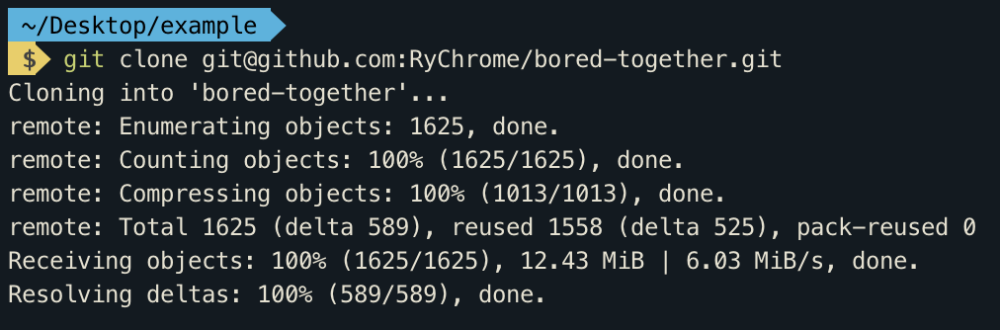

# B(ored) Together

B(ored) Together is an iOS application that allows random people in the same location to connect over similar interests in a safe and friendly way. 

## Getting Started

These instructions will get you a copy of the project up and running on your local machine for development and testing purposes. See deployment for notes on how to deploy the project on a live system.

### Prerequisites

#### [NOTE] An Apple computer is required to develop & test  iOS applications.
_If you don't have the capability to run this iOS application, we have provided a YouTube link [here]()._

If you have an Apple computer, you can start the development process by downloading the latest version of Xcode from the [Apple developer website](https://developer.apple.com/) or the Mac App Store.

### Installing

Once you have Xcode installed, open a terminal of your choice, and run the following command:

```
run xcode-select --install
```

From here clone the GitHub repository in a desired location on your computer:

HTTPS
```
https://github.com/RyChrome/bored-together.git
```
SSH
```
git@github.com:RyChrome/bored-together.git
```
After a successful clone of the repository, you should have something like this:


The repository is structured as a backend and a frontend, with the [bored-together]() directory and the [apollo]() directory representing each one respectively.

### Frontend setup 
To open the XCode project and begin development in the iOS environment do the following:
```
cd bored-together && open bored-together.xcworkspace
```
After this command, you should be introduced to the frontend of our project.


### Backend setup 
To open the backend project

## Deployment

Add additional notes about how to deploy this on a live system

## Built With

* [Swift](https://swift.org/documentation/) - iOS stack
* [GraphQL](https://graphql.org/) - Query Language for API
* [Bored API](http://www.boredapi.com/) - Random API that we had to use
* [neo4j](https://neo4j.com/) - Graph Database

## Versioning

We use [SemVer](http://semver.org/) for versioning. For the versions available, see the [tags on this repository](https://github.com/RyChrome/bored-together/tags). 

## Authors

* *Ryan Dils* - iOS, UI/UX, wannabe rapper - 
    * [GitHub](https://github.com/RyChrome)
    * [LinkedIn](https://www.linkedin.com/in/ryanallendils)
* *Dennis Fedorishin* - iOS, UI/UX - 
    * [GitHub](https://github.com/RyChrome)
    * [LinkedIn](https://www.linkedin.com/in/dennis-fedorishin/)
* *Alexander Stone* - Backend developer - 
    * [GitHub](https://github.com/RyChrome)
    * [LinkedIn](https://www.linkedin.com/in/alexanderwstone/)
* *Ryan Thomas* - Backend developer - 
    * [GitHub](https://github.com/RyChrome)
    * [LinkedIn](https://www.linkedin.com/in/ryan-thomas-233711139/)
* *Baily Troyer* - iOS, UI/UX, Swift guru - 
    * [GitHub](https://github.com/RyChrome)
    * [LinkedIn](https://www.linkedin.com/in/bailytroyer/)

## License

This project is licensed under the MIT License - see the [LICENSE.md](LICENSE.md) file for details
